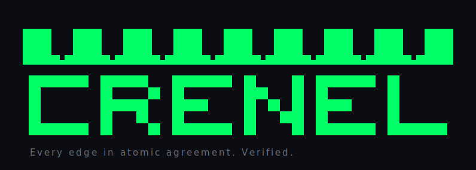

# Crenel Visual Identity

Crenel's look is **tech-noir terminal**: a brutalist battlement wordmark and a
radium-green-on-near-black diagnostic HUD. The aesthetic isn't decoration; it
encodes the product. The logo *is* a battlement (default-deny: a solid wall with
deliberate gaps), and **color carries meaning** (see the semantic rule below).

Everything here is rendered by `internal/ui` (a pure, deterministic presentation
layer) so the terminal output and the SVG assets share one source of truth.

## Name & casing (the writing convention)

Three forms, three jobs, applied consistently across every doc:

- **Crenel** (Title case, plain text): the project as a proper noun in prose:
  "Crenel reads the live edge." Never bold or italicize routine mentions; the
  name is not an emphasis device.
- **`crenel`** (monospace): only the literal command/binary/package:
  "run `crenel status`", `crenel.settings.yaml`, `cmd/crenel`.
- **CRENEL** (all caps): reserved for the wordmark/banner art itself; never
  in prose.
- Lowercase *crenel* in plain prose survives only as the **common noun** (the
  architectural gap in a battlement) when explaining the metaphor.

On a web surface (crenel.sh), a subtle CSS treatment of the name is fine
(color, not weight); see `site/`.

## Palette

| Role | Hex | ANSI (truecolor fg) | Meaning |
|------|-----|---------------------|---------|
| Radium green | `#00FF66` | `38;2;0;255;102` | **safe / private / verified** |
| Amber | `#FFB000` | `38;2;255;176;0` | **about to go public / drift detected** |
| Red | `#FF3B30` | `38;2;255;59;48` | **fail-open / unexpectedly exposed** |
| Steel (dim) | `#6A6F7A` | `38;2;120;126;138` | labels, rules, neutral chrome |
| Value text | `#C8CDD6` | n/a | neutral values (SVG) |
| Background | `#0C0D12` | n/a | near-black canvas |
| Panel | `#111320` | n/a | HUD panel fill |

**Light-surface tokens** (the light wordmark variant only, for a README/page on a
light background; the radium green is too bright to read on near-white):

| Role | Hex | Meaning |
|------|-----|---------|
| Light canvas | `#F5F6F8` | soft off-white background |
| Ink | `#0C0D12` | letter body on light (the dark canvas, reused as ink) |
| Deep green | `#00A34D` | crenellated crown on light: the semantic green, darkened for contrast |
| Dim (light) | `#5B616B` | tagline / chrome on light |

### The semantic color rule (load-bearing)

Color is **never** used as vibe. Every colored token answers "how exposed is
this?":

- **green**: safe / private / verified (default-deny enforced, no drift, a
  private/mesh exposure, a read-back-verified apply);
- **amber**: *about to go public* or *drift detected*, the watched surface (a
  public hostname, a host that diverged from the canonical exposed set);
- **red**: *fail-open* / unexpectedly exposed (the catch-all default-deny is
  missing, a critical invariant violation).

The same rule governs the CLI (`internal/ui/style.go`, the `Sem` roles) and the
SVG (`internal/ui/svg.go`). If a future surface adds a field, it picks a role,
not a color.

**Machine-readable tokens:** [`docs/brand/crenel-tokens.css`](docs/brand/crenel-tokens.css)
exposes the whole palette + typography as CSS custom properties (`--crenel-safe`,
`--crenel-warn`, `--crenel-fail`, …) for a future dashboard/web surface. It mirrors
the Go constants above; the Go renderers remain the source of truth.

## Typography

- **UI / wordmark voice:** Geist / SF Mono (monospace), letter-spaced for the
  brutalist feel.
- **SVG font stack:** `'SF Mono','Geist Mono','JetBrains Mono',ui-monospace,monospace`.
- The terminal naturally uses the user's monospace font; the block wordmark is
  drawn from full-block glyphs so it renders identically anywhere UTF-8 does.

## The wordmark

A brutalist block-letter **CRENEL** whose **top edge is crenellated**: a row of
merlons standing on a solid parapet, with crenel gaps between them. The mark
therefore literally *is* a battlement, fusing logo, name, and the default-deny
idea ("a solid wall with deliberate gaps you choose to open").

### (a) ANSI / Unicode-block (terminal): utility surface, retired as a mark

```
███  ███  ███  ███  ███  ███  ███
███████████████████████████████████
█████ ████  █████ █   █ █████ █
█     █   █ █     ██  █ █     █
█     ████  ███   █ █ █ ███   █
█     █  █  █     █  ██ █     █
█████ █   █ █████ █   █ █████ █████
```

Rendered green on a terminal; falls back to plain blocks with no ANSI when color
is disabled. Produced by `ui.Style.WriteWordmark` (the bare-`crenel` landing).
**Not a brand mark:** the canonical letterforms are the wall banner's outlined
blocks (a2); this solid-block set survives only as a compact utility rendering.

### (a2) The battlement banner: THE canonical mark

> **Brand LOCKED (final, 2026-07-02): the identity is the living battlement WALL**,
> the banner at the top of the README and of `crenel banner` / `status --hud`.
> There is exactly **one tagline, used everywhere** (README header, docs headers,
> repo description, social preview): *"Every edge in atomic agreement. Verified."*,
> paired with the explainer subhead (*"One file or command declares what's public →
> edge allowlist + split-horizon internal/public DNS, default-deny, with plan/apply
> preview."*). The banner itself carries **no headline**, only the small ✓/▸/✕
> legend (*verified / about-to-go-public / fail-open*) keying the gap markers.
> Everything else (the block wordmark, the SVG companion, the HUD) is a supporting
> surface. The wall replaced
> an earlier drop-shadow primary (depth comes from **character texture, never a
> shadow**), and this lock supersedes the earlier "crisp SVG canonical" note.

`crenel banner` and the top of `status --hud` print a crenellated wall: merlon teeth
(bright stone `█` with a dim `▓` core) whose **crenel gaps are the exposed hosts**,
each painted by its semantic role: green `● host ✓` (verified/private), amber
`● host ▸ public` (about to go public), red `● host ✕ open` (fail-open). Below it the
**CRENEL wordmark** in the pagga half-block font (the distinctive ∏-shaped `n`), with
OPEN counters and a bright-rim→deep-core **tube bevel** for dimension. *No* extrusion.

The gaps are **live**: under `status --hud` they show the real exposed hosts (from the
same read-only status read as the CORE MATRIX panel), painted with the `Sem` roles;
`crenel banner` standalone shows `*.crenel.sh` demo hosts; nothing exposed renders a
**solid default-deny wall**. Produced by `ui.Style.WriteHeroBanner` / `writeWall`; the
beveled wordmark is pinned byte-for-byte to the approved still by a fingerprint test.

### (b) SVG: the vector companion (one pair, no variants)

For surfaces that can't render the terminal wall (a favicon, a social card, a web
page), there is exactly **one** vector mark: `crenel-wordmark.svg` (dark) /
`crenel-wordmark-light.svg` (light), produced by `ui.WordmarkSVG()` /
`ui.WordmarkSVGLight()`. It shares the **letter glyph grid** with the ANSI wordmark
and draws the crown as crisp vector geometry: a real square-tooth battlement
(9 merlons on a solid parapet) where the negative-space gaps *are* the crenels.
The tagline beneath it is **"Every edge in atomic agreement. Verified."** (mono,
letter-spaced, muted).

- **Dark** = radium green (`#00FF66`) on near-black; letters green.
- **Light** = deep verified-green (`#00A34D`) crown over **ink** letters on soft
  off-white (the radium green is too bright on near-white).

Earlier exploratory variants (scanline/boxline/mono treatments) were dropped
during the 2026-06-29 lock — one lane, one mark. Their renderers were removed
from `internal/ui` entirely, not just the generated files; `WordmarkSVG` /
`WordmarkSVGLight` render only the winning (crisp) treatment. The committed
SVGs are regenerated from the renderer, never hand-edited (guarded by
`TestWordmarkSVG_Deterministic`). Use a `<picture>` element to serve the right
surface:

```html
<picture>
  <source media="(prefers-color-scheme: light)" srcset="docs/brand/crenel-wordmark-light.svg">
  
</picture>
```

## The status HUD

The diagnostic-HUD panel (the maintainer's "CORE MATRIX INTERCONNECT" sketch) is the
**real `crenel status` output**, not a mock. Its metrics are Crenel's actual
domain fields, wired to live state:

```
╭ CORE MATRIX // EXPOSURE STATE ─────────────────────────────╮
│ ● EXPOSED      4 hosts  (4 public)                         │
│ ● DEFAULT-DENY ENFORCED                                    │
│ ● DRIFT        none                                        │
│ ● EDGES        home·traefik  vps·traefik                   │
│ ● DNS          (none managed)                              │
│ ● LAST APPLY   unknown — live is the only source of truth  │
╰────────────────────────────────────────────────────────────╯
legend: ● safe/private · ● public/drift · ● fail-open
```

The rounded frame, the per-row **semantic status dot** (an at-a-glance LED rail:
each `●` is colored by that field's role), and the colored title are the terminal
art; the SVG mock adds green corner-crops and a left dot rail in the same spirit.

| Field | Source | Color |
|-------|--------|-------|
| `EXPOSED` | hosts exposed across edges; `(m public)` mirrors `core.computeNewPublic` | amber when a public surface exists, else green |
| `DEFAULT-DENY` | `DenyCatchAllPresent` on **every** edge | green ENFORCED / red FAIL-OPEN |
| `DRIFT` | `DetectDrift` vs the canonical exposed set | green `none` / amber `n items` |
| `EDGES` | the configured topology (`name·driver`) | green |
| `DNS` | managed scopes (split-horizon internal + public) | green / dim |
| `LAST APPLY` | no persisted desired state → `unknown` | dim (by design, not an error) |

[`docs/brand/crenel-status-hud.svg`](docs/brand/crenel-status-hud.svg) is the SVG of
this HUD, the early read-only-dashboard mock (the S5 milestone, drawn ahead).

## Usage

- **CLI banner.** `crenel status` draws a **compact colored header** by default on
  a terminal; `crenel status --hud` (alias `--banner`) draws the **full HUD
  banner**. `crenel` with no command shows the wordmark landing.
- **Scriptability.** `--plain`, a non-TTY pipe, or `--json` suppress the branded
  chrome and emit clean output. Color is gated on a TTY with `NO_COLOR` unset.
- **README / docs.** Lead with the battlement-wall banner (as the README does;
  a fenced code block renders it faithfully on GitHub/Forgejo). Reach for the SVG
  pair only where a code block can't go (favicon, social card, web page).
- **Future dashboard.** `docs/brand/crenel-status-hud.svg` is the design target for
  the eventual read-only dashboard; it already uses the real field names.

## Regenerating the assets

The SVGs are generated from the same renderers the CLI uses, so they can never
visually drift from the terminal output:

```bash
CRENEL_GEN_ASSETS=1 go test ./internal/ui/ -run TestGenerateAssets
```
