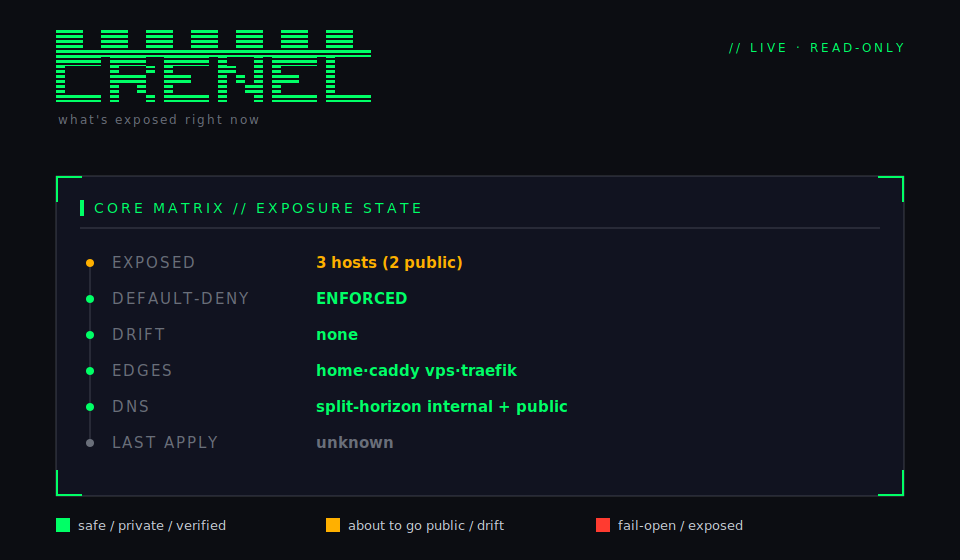

# Crenel

[](https://github.com/crenelhq/crenel/actions/workflows/ci.yml)

```
                             ███████   ███████   ███████   ███████
                             █▓▓▓▓▓█ ✓ █▓▓▓▓▓█ ▸ █▓▓▓▓▓█ ✕ █▓▓▓▓▓█
                             █▓▓▓▓▓█   █▓▓▓▓▓█   █▓▓▓▓▓█   █▓▓▓▓▓█
                             █████████████████████████████████████
                             ▓▓▓▓▓▓▓▓▓▓▓▓▓▓▓▓▓▓▓▓▓▓▓▓▓▓▓▓▓▓▓▓▓▓▓▓▓
                             ▒▒▒▒▒▒▒▒▒▒▒▒▒▒▒▒▒▒▒▒▒▒▒▒▒▒▒▒▒▒▒▒▒▒▒▒▒
                             ░░░░░░░░░░░░░░░░░░░░░░░░░░░░░░░░░░░░░

  ████▀▀▀▀▀███    ████▀███        ████▀▀▀▀▀███    ████▀▀▀▀████    ████▀▀▀▀▀███    ████
  ██▀▀▀▀▀▀▀▀▀█    ███▀▀▀▀█        ███▀▀▀▀▀▀▀▀█    ███▀▀▀▀▀▀███    ███▀▀▀▀▀▀▀▀█    ████
  ████            ████    █▀▀█    ████            ████    ████    ████            ████
  ████            ████    █▀▀█    ████            ████    ████    ████            ████
  ████            ███▀▀▀▀█        ███▀▀▀▀▀▀▀▀█    ████    ████    ███▀▀▀▀▀▀▀▀█    ████
  ████            ███▀▀▀▀█        ███▀▀▀▀▀▀▀▀█    ████    ████    ███▀▀▀▀▀▀▀▀█    ████
  ████            ████    █▀▀█    ████            ████    ████    ████            ████
  ████            ████    ████    ████            ████    ████    ████            ████
  ▀▀█▀▀▀▀▀▀▀▀█    ████    ████    ███▀▀▀▀▀▀▀▀█    ████    ████    ███▀▀▀▀▀▀▀▀█    ███▀▀▀▀▀▀▀▀▀
  ▀▀▀▀▀▀▀▀▀▀▀█    █▀▀█    █▀▀█    █▀▀▀▀▀▀▀▀▀▀█    █▀▀█    █▀▀█    █▀▀▀▀▀▀▀▀▀▀█    █▀▀▀▀▀▀▀▀▀▀▀
                                                                                            
                      ✓ verified   ▸ about-to-go-public   ✕ fail-open
```

<p align="center">
  <strong>Every edge in atomic agreement. Verified.</strong><br><br>
  <strong>Crenel</strong> <code>/ˈkrɛn.əl/</code> — rhymes with kennel <br><br>
  <em>One file or command declares what's public → edge allowlist + split-horizon
  internal/public DNS, default-deny, with plan/apply preview.</em>
</p>

> A *crenel* is the gap in a castle's battlement: the deliberate opening you choose
> to expose. The banner **is** that battlement: a solid default-deny wall whose gaps
> are your live exposed hosts, each colored by state (green verified, amber about to
> go public, red fail-open). "Crenel" (/ˈkrɛn.əl/, rhymes with kennel or fennel).

<p align="center">
  <em>License: Apache-2.0 (open-core) · Dependencies: standard library only</em>
</p>

## Why Crenel

Crenel doesn't replace your stack. It makes the tools you already run
(Caddy / Traefik / nginx, AdGuard, Cloudflare, Tailscale) work better together:
a control plane, not another proxy or tunnel.

You could manage edge exposure three other ways, and each fails in a specific spot:

- **By hand** (Caddyfile + DNS dashboards + a tunnel config): every change is several
  independent edits that fail *silently*. A wildcard left open, a forgotten auth gate,
  two resolvers quietly disagreeing. Nothing errors; you find out later.
- **Declarative IaC (Terraform-style)**: a stored desired state that drifts from the
  live system the moment anything else touches it. And "apply succeeded" is not proof
  the edge actually serves what the plan said.
- **An integrated tunnel appliance** (Pangolin and friends): gets coherence by
  *replacing* your stack. Great greenfield; no help for the Caddy/Traefik/nginx + DNS
  setup you already run and trust.

Crenel is the fourth option: **it drives the stack you already have**, treats the live
edge as the only source of truth (nothing stored to drift), applies changes across every
edge + DNS provider **atomically**, and **re-reads the live system to prove the change
landed**. Remove it tomorrow and your infrastructure keeps running untouched.

The sweet spot is **multi-edge**: a home proxy plus a lean VPS edge plus an overlay and
split-horizon DNS is exactly where hand-kept configs drift and leak. Crenel keeps every
edge in atomic agreement (a service is exposed correctly across all of them, or not at
all), and `audit`/`drift` prove what's exposed right now. No guessing.

**New here?** [`docs/WHAT-CRENEL-DOES.md`](docs/WHAT-CRENEL-DOES.md) is the plain-English
explainer (no engineering background assumed). [`STATE-OF-CRENEL.md`](STATE-OF-CRENEL.md)
is the exact, honest current state: what's built, what's live-proven, what's still open.

**Plain-English:** Crenel is a command-line tool that controls what your
home-lab / self-hosted reverse proxy lets the outside world reach. Instead of
editing config files by hand and hoping, you say "expose my photos app" or "stop
exposing it," and Crenel looks at what's *actually live right now*, shows you
exactly what will change (and loudly flags anything about to become public),
makes the change, and then re-checks the live system to prove the change really
happened. Nothing is reachable unless you explicitly opened it.

**Technical:** Crenel is a vendor-agnostic, live-state-authoritative CLI built on
a hexagonal ports-and-adapters core. It holds no persisted desired state / source
of truth: the only intent is the transient `Op` of the command being run, and
the only truth is what the edge reports live. It models reverse-proxy edges
(Caddy / Traefik / nginx), internal/public DNS (dnscontrol), and origin resolution
behind `EdgeProvider` / `DNSProvider` / `OriginResolver` ports; identity-mesh state
(NetBird) is read-only — surfaced, not driven. Every mutating verb runs
`read-live → plan → apply →
read-back-verify`, treating an admin-API `200` as *not* proof of application. A
structural catch-all default-deny is a hard driver invariant: a host is reachable
iff an explicit expose added it. A third invariant, **bounded honesty**,
keeps it safe on configs it doesn't fully model: anything `normalize` cannot parse
becomes a *declared unknown* (counted in `status`/`audit`), default-deny is reported
ENFORCED only when the config was fully parsed (otherwise UNKNOWN, never green), and
Crenel **refuses to manage** a route/edge owned by another tool (a config generator)
or whose ownership it can't determine. See `TOPOLOGY-RISK-REGISTER.md`.

## The status HUD

`crenel status` is the live answer to **"what's exposed right now."** On a
terminal it draws a branded, color-coded HUD wired to real state; piped or
`--plain` it degrades to clean scriptable text.

<p align="center">
  
</p>

```
╭ CORE MATRIX // EXPOSURE STATE ─────────────────────────────╮
│ ● EXPOSED      4 hosts  (4 public)                         │
│ ● DEFAULT-DENY ENFORCED                                    │
│ ● DRIFT        none                                        │
│ ● EDGES        home·traefik  vps·traefik                   │
│ ● DNS          (none managed)                              │
│ ● LAST APPLY   unknown — live is the only source of truth  │
╰────────────────────────────────────────────────────────────╯
legend: ● safe/private · ● public/drift · ● fail-open
```

Color **carries meaning**: green = safe/private/verified, amber = about to go
public / drift detected, red = fail-open / unexpectedly exposed. See
[`BRANDING.md`](BRANDING.md) for the palette, the semantic rule, and the canonical
battlement-wall mark (plus its SVG companion in [`docs/brand/`](docs/brand/)).

- `crenel status`: compact colored header + detail (plain when piped)
- `crenel status --hud` (`--banner`): full HUD banner
- `crenel status --plain` / `--json`: scriptable output, no chrome
- Honors `NO_COLOR` and non-TTY (degrades to plain ASCII)

## No dependencies, on purpose

Crenel imports nothing outside the Go standard library. `go.mod` has no `require`
block, and the dependency graph is empty.

For a tool that reaches into your reverse proxy, your DNS, and your auth, that's a
deliberate trust decision, not a minimalist flex:

- The supply chain is auditable in an afternoon. There's no transitive dependency
  tree to vet — the only third-party code in the trust boundary is the Go toolchain
  itself. No node_modules-style tail of sub-dependencies you've never read.
- Nothing to rot. Dependencies get abandoned, renamed, or compromised; a
  stdlib-only tool keeps building years from now with no version churn.
- A small static binary you can drop on a box and verify by hash.

The drivers talk to Caddy's admin API, Cloudflare, AdGuard, and the rest over
plain `net/http` — no vendored SDKs. If you want to know exactly what crenel can
do to your edge, you can read all of it.

Not Terraform — reads the live edge, no state file to drift. See
[`docs/WHAT-CRENEL-DOES.md`](docs/WHAT-CRENEL-DOES.md#how-is-this-different-from-terraform-or-ansible).

## Install

```bash
go install github.com/crenelhq/crenel/cmd/crenel@latest   # puts `crenel` on $PATH
# or, from a clone:
make install                                              # go install with version stamp
make build                                                # -> ./dist/crenel
```

Cross-compile for a server (static, zero-dependency binaries, including
linux/arm64 for a small VPS). Nothing is published; binaries land in `./dist`:

```bash
make release        # linux/{amd64,arm64} + darwin/{amd64,arm64} -> ./dist
crenel version
```

## Quickstart: batteries included (one command)

New to Crenel and don't have an edge yet? The [`bundle/`](bundle/README.md) brings up a
working **default-deny Caddy edge + Crenel + a read-only status dashboard + a demo
upstream** with one command. Zero assembly:

```bash
cd bundle && docker compose up -d
# unmatched host -> 403 (default-deny); then:
docker compose exec crenel crenel expose demo --auth none   # read-back ✓
# the demo host now serves 200; the HUD shows it. `unexpose` puts it back to 403.
```

Fresh service with no pre-declared origin? `--to` names the backend inline and
persists it into the origins map on a verified apply. No "edit config first"
step. The public-auth guardrail still fires; the pipeline is unchanged.

```bash
crenel expose photos --to immich:2283 --auth authelia   # backend named inline
# TCP-probes immich:2283 first (refuses to write a route to a dead backend, and
# tells you the three common address shapes if it can't reach it); then routes
# photos.<zone> -> immich:2283, gates behind authelia, verifies read-back, and
# writes `photos: immich:2283` into origins in the settings file so later
# status/audit/drift/reconcile stay coherent.
#
# Backend not up yet but the address is known-correct? Pass --no-validate.
```

Crenel is the control plane, not an appliance. The same binary drives the Caddy /
Traefik / nginx / DNS stack you *already* run (below); the bundle is just a sane
default to start from. See [`bundle/README.md`](bundle/README.md) and `BUNDLE-DESIGN.md`.

## Quickstart: adopt a brownfield setup, then drive it

You already have a hand-built Caddy/Traefik/nginx + DNS edge. Point Crenel at it,
and exposing a service becomes one command:

```bash
crenel expose photos --to immich:2283 --auth authelia
```

That routes `photos.<your-zone>` on your edge(s), adds the internal and public
DNS records, and gates the host behind your auth policy. Previewed first
(anything about to go public is flagged loudly), applied across every provider
as one atomic step, then **verified by re-reading the live edge**. `--to` names
the backend inline: Crenel **TCP-probes it before writing any route** (it
refuses to expose a dead backend; `--no-validate` skips the probe when the
service just isn't up yet) and persists the origin into settings on a verified
apply, so `status`/`audit`/`drift`/`reconcile` stay coherent afterwards.

Crenel adopts your existing setup in place (ownership only, no behavior
change), then lets you drive it imperatively or declaratively. The full flow:

```bash
# 1. Scaffold a starter config (settings + a declarative exposures file).
crenel init
#   -> crenel.settings.yaml   (edge driver, admin_url/path, DNS)
#   -> crenel.exposures.yaml  (desired exposures for `apply`)
# Edit crenel.settings.yaml: set edge_driver + admin_url/path. (An origins map
# is optional; `expose --to` adds origins one service at a time.)

CFG="-config crenel.settings.yaml"

# 2. See what is exposed RIGHT NOW (live; no stored desired state).
crenel $CFG status

# 3. Bring your existing setup under management: preview first, then adopt.
crenel $CFG import --dry-run     # what crenel would adopt (origin must match)
crenel $CFG import               # stamps ownership markers in place, idempotently

# 4. Check consistency / drift at any time (CI-friendly: exits non-zero on drift).
crenel $CFG drift

# 5a. Imperative: flip one host. --to names the backend inline (TCP-probed
#     pre-flight); publishing with NO auth is refused unless explicit.
crenel $CFG expose grafana --to grafana:3000 --auth authelia
crenel $CFG expose status --auth none        # explicitly publish with no auth

# 5b. Declarative: converge to a file (kubectl-style; brownfield-safe).
crenel $CFG apply crenel.exposures.yaml --dry-run    # diff vs live, highlights public
crenel $CFG apply crenel.exposures.yaml --adopt      # adopt matching unmanaged inline

# 6. A route Crenel can't fully model (e.g. scoped by a path/method matcher)
#    stays a declared unknown — and default-deny stays UNKNOWN — forever,
#    unless you tell Crenel it's an intentional carve-out. `ack` stamps that
#    acknowledgment INTO the live config itself (no sidecar store, the same
#    trick the ownership marker already uses), so `audit`/`status` show it
#    as ACK, not a recurring UNKNOWN — and default-deny can certify once
#    everything else IS understood. Never makes the route reachable; that's
#    still only `expose`. `unack` reverts it.
crenel $CFG ack app.example.com --reason vendor-webhook-bypass
crenel $CFG unack app.example.com
```

Caddy edges: add `caddy_persist_path: /etc/caddy/Caddyfile` to survive a
`docker restart` (the admin API is in-memory). Crenel writes its routes between
`# crenel-managed-begin/end`, validates, and reloads, preserving the rest of your
Caddyfile byte-for-byte.

**Forward-auth by reference.** An exposure can carry an `auth:` policy (e.g.
`authelia`) and Crenel renders a *reference* to it per edge: a Caddy
`forward_auth`/`import <snippet>`, a Traefik middleware, or an nginx `auth_request`.
**You** own the actual auth config. Map policy names to references under
`auth_policies` in settings (sensible defaults apply when omitted):

```yaml
auth_policies:
  authelia:
    caddy_forward_auth: authelia:9080    # or caddy_import: authelia
    traefik_middleware: authelia@file
    nginx_auth_request: /authelia
```

Auth is orthogonal to default-deny (routed-to-the-world vs. who's-allowed), is
HTTP-only (refused on SNI passthrough; a mesh grant enforces identity itself), and
is preserved verbatim when you `import` a brownfield route. Publishing a host
**public with no auth** is a loud, explicit choice: `expose`/`apply` refuse it
unless you pass `--auth none` (or `auth: none`), and `audit` flags any public host
with no auth policy (`public_without_auth`).

## Try it with no infrastructure

Every flow runs against the bundled in-process fakes. No real edge needed:

```bash
go build -o bin/crenel ./cmd/crenel
CFG="-config examples/settings-brownfield.json"   # wildcard subroutes + Authelia + an adoptable grafana

./bin/crenel $CFG status                 # see the hand-built setup
./bin/crenel $CFG import --dry-run        # grafana is adoptable; Authelia/subroutes are not
./bin/crenel $CFG import --yes            # adopt in place

# Declarative apply, all in YAML:
./bin/crenel -config examples/settings-apply.yaml apply examples/exposures.yaml --dry-run
```

See `DESIGN.md` for the full architecture, `USABILITY-DESIGN.md` for the
brownfield semantics (adoption / persistence / declarative apply), `AUTH-DESIGN.md`
for forward-auth by reference, `SECURITY.md` for the security/threat model (what
secrets the edge config holds, the loopback-first transport trust model, and the
secret-redaction guarantee), `BRANDING.md` for the visual identity, and
[`docs/AUDIT.md`](docs/AUDIT.md) + [`docs/security/`](docs/security/) for the
third-party-audit package (security model, threat model, claims to verify, known
limits), and [`archive/BUILD_LOG.md`](archive/BUILD_LOG.md) for the frozen
per-increment build history.

## What's proven

Crenel's tests are hermetic (see *Safety* below), but the claims that matter most
have also been exercised against **real production reverse-proxy edges** (the
maintainer's own homelab and VPS), each run recorded byte-for-byte and reverted so
production was left exactly as found. (In the published write-ups, the maintainer's
hostnames and addresses are consistently anonymized to `homelab.example` and
RFC 5737/1918 addresses; the sequences of commands, configs, and results are
otherwise verbatim.) The
individual dated write-ups live in [`archive/trials/results/`](archive/trials/results/)
(superseded-in-place by `STATE-OF-CRENEL.md` and the consolidated
`TRIAL-RECORD-live-proofs-2026-06-30.md`, which stays at the repo root).

- **One-command rename, durable.** `crenel rename old.example new.example` moved a
  service end-to-end on a live Caddy edge and **survived a `docker restart caddy`**
  (it came from the on-disk Caddyfile, not ephemeral admin state). Old name gone,
  new name serving; production restored byte-for-byte.
  *([`TRIAL-RESULT-rename-onecommand-2026-06-28.md`](archive/trials/results/TRIAL-RESULT-rename-onecommand-2026-06-28.md))*
- **Durable persistence.** A live `expose` was reconciled into the boot Caddyfile
  *inside* the existing wildcard site (no shadow top-level block) and **still
  served HTTP 200 after a full container restart**. An ephemeral admin-only write
  would have been wiped. Operator bytes outside Crenel's region unchanged.
  *([`TRIAL-RESULT-durable-persist-2026-06-28.md`](archive/trials/results/TRIAL-RESULT-durable-persist-2026-06-28.md))*
- **The all-or-nothing net, under fire.** The first live coordinated cross-chain
  write **aborted atomically with zero changes applied** when it surfaced a real
  renderer bug that the entire fake-based suite structurally could not catch: the
  home edge's Caddy rejected the config at load-validation and Crenel rolled back
  *both* edges, touching neither. Production was verified pristine throughout. The
  bug was fixed, the coordinated auth+TLS chain write was then validated live at
  the config level, and a follow-up run drove the gate to the literal
  `302 → auth.…` redirect.
  *([`TRIAL-RESULT-chain-write-2026-06-28.md`](archive/trials/results/TRIAL-RESULT-chain-write-2026-06-28.md)
  + reruns; the trial catching a bug the fakes couldn't is itself the point.)*

- **DNS hardening, surgical apply, LIVE-PROVEN on a real Cloudflare zone.** The hardened
  `dnscontrol` path ran end-to-end against the live `CLOUDFLAREAPI` on the dedicated
  `crenel.sh` zone (TTL + proxied fidelity preserved, idempotency ×2, true cross-provider
  rollback). A separate **surgical record-level apply mode** then proved on the same zone
  that Crenel can manage a single record inside a *shared* zone without touching foreign
  records: the ownership marker `managed-by:crenel` is the safety boundary, and the
  mutate primitives REFUSE any record lacking it (defense in depth). Zone restored
  byte-identical empty. The **shared-zone trial on the real `homelab.example` zone is now
  PROVEN LIVE (2026-06-30):** only Crenel's marked record was touched, the pre-existing apex
  wildcard stayed byte-identical across expose/unexpose. *(STATE-OF-CRENEL.md §0a, §6.z A0;
  `TRIAL-RECORD-live-proofs-2026-06-30.md` §1; PRs #10, #11)*

- **The whole chain, as one command, on the real stack.** The first full coordinated
  production expose (`finances.homelab.example`, from the home-edge host) was driven end-to-end by a single
  `crenel` run: the home edge route, the VPS edge allowlist, both internal AdGuard rewrites, and
  the public Cloudflare record, all gates green with default-deny intact. The dual-AdGuard
  split-horizon parity trial ran the same day (both resolvers restored byte-for-byte; the
  `dns_coverage_parity` audit caught a real divergence live). *(`TRIAL-RECORD-live-proofs-2026-06-30.md` §2–§3)*

Everything else is proven against faithful in-process fakes and fixtures: all four
edge drivers, the DNS providers (Cloudflare via `dnscontrol`, surgical Cloudflare
REST, AdGuard control API), the invariants, every verb. **498 test functions,
race-clean across 17 test packages**, under a strict rule: *a fake may only accept
what the real edge accepts, and must reject what it rejects.* See
[`CONTRIBUTING.md`](CONTRIBUTING.md) for
that testing bar and the trial-before-merge cadence for edge-touching changes.

## Documented limits (honest)

Crenel's "never silently wrong" promise extends to its limits: what it CAN'T do is as
loud as what it can. These are the gaps that today are detected-and-declared (safe-by-
default) but not actively resolved:

- **Marker-less AdGuard value drift is not detected.** The `dns_value_drift` audit and
  `DriftValueDNS` reconcile-side correction are scoped to a provider that proves its
  records carry an ownership marker (surgical Cloudflare). AdGuard rewrites are
  `{domain, answer}` with no per-record metadata field, so Crenel cannot tell a foreign
  rewrite from a stale Crenel one; value-checking AdGuard would cry wolf on the
  operator's intentional rewrites. The check is deliberately opt-in via the
  `ports.OwnedRecordReporter` capability that AdGuard does NOT implement.
- **Path-granular routing is DETECTED, not yet MODELED.** A route scoped by a non-host
  matcher (Caddy `path`/`method`/`header`, Traefik `&& PathPrefix()`, nginx multiple
  `location` blocks) is declared `matcher_conditional` and forces deny to UNKNOWN, so
  it is never silently misread. But Crenel cannot yet REPRESENT or WRITE a per-path
  backend or per-path auth. The write side is a P5 model + per-driver render task. If
  the carve-out is intentional, `crenel ack <host> --reason <slug>` (see
  [`docs/design/ack-marker.md`](docs/design/ack-marker.md)) lets the operator say so —
  a marker written into the live config, read back on every future run, that reclassifies
  the route as acknowledged (not blocking, still fully visible in `audit`/`status`) without
  changing what's reachable. Read-side recognition works across Caddy/Traefik/nginx; the
  `ack`/`unack` write verbs are Caddy-only for now.
- **Tailscale serve.json `Web` entries without `AllowFunnel` are not modeled as a
  separate scope.** PR #17 stops the cry-wolf (a tailnet-only `Web` host is no longer
  falsely flagged `public_without_auth`) but does not introduce a mesh-scope axis for
  it. Adding one would be a model extension orthogonal to the existing route modes.
- **Whole-zone Cloudflare push (`apply_mode: "" / whole-zone`) requires
  `dedicated_zone: true`.** Crenel default-denies a whole-zone `dnscontrol push` on a
  zone holding any pre-existing foreign record. The surgical mode (`apply_mode:
  surgical`) is the path for shared zones, with no `dedicated_zone` requirement.
- **Live-trial cadence for shared/production targets.** Anything that touches a shared
  production target is a separately gated live trial, never bundled into a normal PR. The
  shared-zone Cloudflare write and the production cross-chain coordinated write have since
  cleared that gate (proven 2026-06-30); a **write through a Tailscale serve config** is the
  one such path still unbuilt/untrialed. See [`archive/trials/`](archive/trials/) and
  `TRIAL-RECORD-live-proofs-2026-06-30.md` for the cadence.

`STATE-OF-CRENEL.md` §6.z buckets each open item by what it needs to ship: **A (live-only)**,
**B (structural / model-extension)**, **C (docs / launch-readiness)**.

## License, open-core & contributing

- **License:** Apache-2.0 (`SPDX-License-Identifier: Apache-2.0`;
  [`LICENSE`](LICENSE), [`NOTICE`](NOTICE); © 2026 The Crenel Authors). The
  Apache core is the whole product for an individual operator; a later, separately-licensed
  enterprise directory (e.g. a compliance/audit ledger) is the only thing on the
  far side of the line. The boundary is enforced in code (core never imports a
  driver); see [`docs/OPEN-CORE.md`](docs/OPEN-CORE.md).
- **Name & trademark:** the name and wordmark are reserved by the maintainers
  (nominative use is fine).
- **Contributing:** external PRs welcome under **DCO** (per-commit
  sign-off, [`DCO.txt`](DCO.txt)) **+ a one-time CLA** ([`CLA.md`](CLA.md)) before a
  first merge. Build/test/PR flow, the faithful-fake bar, and the trial cadence are
  in [`CONTRIBUTING.md`](CONTRIBUTING.md); participation is governed by the
  [`CODE_OF_CONDUCT.md`](CODE_OF_CONDUCT.md).

## Safety

Two different things are both true here, and they don't contradict each other:

- **The automated test suite (`go test` / `make check`) never touches real
  infrastructure.** Every test runs against in-repo fakes: a fake Caddy admin
  API (an `httptest` server, loopback-only), Caddyfile/JSON fixtures,
  file-provider configs for Traefik/nginx, and a mocked `dnscontrol` shell
  runner (an in-memory fake DNS provider). No test in the suite opens a socket
  to a real edge, a real DNS provider, or the public internet — this is
  enforced as a hard rule (see *The faithful-fake testing bar* in
  [`CONTRIBUTING.md`](CONTRIBUTING.md)), not just a convention.
- **The "What's proven" claims above are separate, and manual.** Those write
  paths were exercised by the maintainer running `crenel` directly against
  real production edges — never through `go test`, never automatically — with
  a backup + read-back-verify + revert (or intentionally left, byte-for-byte
  confirmed) around every one. See
  [`TRIAL-RECORD-live-proofs-2026-06-30.md`](TRIAL-RECORD-live-proofs-2026-06-30.md)
  for the record; hostnames there are anonymized, the commands and results are
  verbatim.
- **A file-driver write with no runtime probe configured is REFUSED, not silently
  accepted.** Traefik/nginx without a configured runtime URL can only re-read the file
  Crenel just wrote — never proof the running daemon picked it up. Rather than stand as
  an unconfirmed "written, not verified" green, the write is now rolled back unless you
  pass `--allow-unverified` (or accept interactively when not running `--yes`). Caddy is
  unaffected — its own admin-API re-read already is the live check.

## Acknowledgments

Built with the assistance of [Claude Code](https://claude.com/claude-code).
