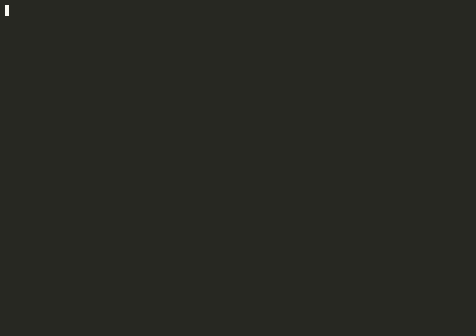

<p align="center">
  
</p>

# Crenel

[](https://github.com/crenelhq/crenel/actions/workflows/ci.yml)
[](LICENSE)

**Crenel is a zero-dependency CLI that keeps a split-horizon homelab honest.**
One command exposes a service locally or publicly — across Caddy, AdGuard, and
Cloudflare in one atomic step — then **re-reads the live edge to prove the change
actually landed**. Nothing is reachable unless you explicitly opened it, and
`audit`/`drift` can prove that at any moment.

```bash
crenel expose photos --to immich:2283 --auth authelia
# → proxy route on every edge, internal DNS rewrite, public DNS record,
#   auth gate — previewed, applied atomically, then VERIFIED by read-back.
crenel status     # what is exposed RIGHT NOW (live state, nothing stored)
crenel drift      # CI-friendly: exits non-zero if reality disagrees
```

<p align="center">
  
</p>

## Is Crenel for you?

Be honest with yourself first — most people don't need it:

- **You just want to expose services to the internet?** Use
  [Pangolin](https://github.com/fosrl/pangolin) or Cloudflare Tunnel. They're
  excellent, and Crenel doesn't compete with them.
- **Every device you care about can run a mesh client?** Tailscale Serve/Funnel
  or NetBird's public/private service toggle already give you one-switch
  exposure. Take the simpler stack.

Crenel is for the setup those tools structurally can't cover — **split-horizon
on your own domain**: clientless LAN devices (TVs, IoT, guests) resolving
`app.your.domain` to a *local* proxy at LAN speed, the same name resolving
publicly through a hardened edge, AdGuard doing your filtering, and you owning
every hop. That topology means one logical change touches four or five systems
— proxy routes, internal DNS rewrites, public DNS records, auth gates — and
keeping them agreeing by hand is exactly where silent drift and accidental
exposure live. Crenel makes that one verified command.

|  | By hand | Terraform-style IaC | Pangolin / tunnel appliance | NetBird services | **Crenel** |
|---|---|---|---|---|---|
| Reverse-proxy routes | manual edits | ✅ | ✅ (replaces your proxy) | ✅ (its own proxy) | ✅ drives *your* proxy |
| Public DNS records | manual | ✅ | wildcard once | manual CNAME | ✅ |
| Split-horizon LAN DNS (clientless devices) | manual | rare/roll-your-own | ❌ | ❌ (mesh-only) | ✅ AdGuard rewrites |
| Local ↔ public toggle per service | ❌ | ❌ | partial | ✅ (mesh = "local") | ✅ |
| **Verified against live state** | ❌ | ❌ (state file drifts) | ❌ | ❌ | ✅ read-back, every write |
| Default-deny proven, not assumed | ❌ | ❌ | ❌ | ❌ | ✅ `audit` / `drift` |
| Keeps your existing stack | — | ✅ | ❌ greenfield | ❌ replaces mesh+proxy | ✅ removable anytime |

Remove Crenel tomorrow and your infrastructure keeps running untouched — it's a
control plane over the tools you already trust, not another proxy or tunnel.

## What works with what

The architecture is vendor-agnostic (ports-and-adapters; a new driver is a
contribution, not a rewrite), but honesty about the *implemented* surface:

| Driver | Read / status | Write (expose etc.) | Verify (read-back) | Notes |
|---|---|---|---|---|
| **Caddy** | ✅ admin API | ✅ + durable Caddyfile persist | ✅ | first-class path; `ack`/`unack` supported |
| **Traefik** | ✅ file provider | ✅ file only | ⚠️ file re-read; runtime probe opt-in | write refused without probe URL unless `--allow-unverified` |
| **nginx** | ✅ file | ✅ file only | ⚠️ same as Traefik | managed-block re-render fidelity documented |
| **Cloudflare DNS** | ✅ | ✅ surgical (shared zones) or whole-zone (dedicated) | ✅ | ownership marker `managed-by:crenel` |
| **AdGuard Home** | ✅ rewrites | ✅ (dual-instance aware) | ✅ presence | value-drift detection deliberately opt-out (see limits) |
| **Tailscale** | ✅ serve.json read | 🚧 planned | — | write path unbuilt/untrialed |
| **NetBird** | ✅ read-only | — by design | — | mesh grants surfaced, never driven |
| **Auth (forward-auth)** | — | ✅ by reference (Authelia, any) | ✅ | you own the auth config; Crenel renders the reference |

## Why trust it with your edge

- **Zero dependencies.** `go.mod` has no `require` block — Go standard library
  only. The entire supply chain in your trust boundary is the Go toolchain. The
  drivers speak plain `net/http` to Caddy/Cloudflare/AdGuard; you can read all
  of it in an afternoon, and it will still build years from now.
- **Live state is the only truth.** No stored desired state, no state file to
  drift. Every mutating verb runs `read-live → plan → apply → read-back-verify`;
  an admin-API `200` is never accepted as proof.
- **Structural default-deny.** A host is reachable *iff* an explicit expose
  added it — a hard driver invariant, and `audit` proves it against live state.
- **Bounded honesty.** Config Crenel can't fully parse becomes a *declared
  unknown* — counted in `status`/`audit`, never silently green. Routes owned by
  another generator (NPM, Pangolin, caddy-docker-proxy) are detected and
  **refused**, not clobbered.
- **Atomic across the chain.** A coordinated write across two edges + two DNS
  planes either fully lands or fully rolls back — proven live (see below).
- Publishing a host **public with no auth** is refused unless you say
  `--auth none` out loud, and `audit` flags any `public_without_auth` host.

## Install

```bash
go install github.com/crenelhq/crenel/cmd/crenel@latest
```

Or grab a static binary for linux/darwin (amd64/arm64) from
[Releases](https://github.com/crenelhq/crenel/releases) — zero-dependency,
verify by SHA256. From a clone: `make build` (host platform) or `make release`
(cross-compile to `./dist`).

## Quickstart: batteries included (one command)

No edge yet? The [`bundle/`](bundle/README.md) brings up a working default-deny
Caddy edge + Crenel + a read-only dashboard + a demo upstream:

```bash
cd bundle && docker compose up -d
# unmatched host -> 403 (default-deny); then:
docker compose exec keep crenel expose demo --auth none   # read-back ✓
# demo host now serves 200; the HUD shows it. `unexpose` puts it back to 403.
```

## Quickstart: adopt the setup you already run

Point Crenel at your existing hand-built edge; it adopts in place (ownership
markers only, zero behavior change) and exposing becomes one command:

```bash
crenel init                       # scaffolds settings + declarative exposures file
CFG="-config crenel.settings.yaml"

crenel $CFG status                # what's exposed RIGHT NOW, live
crenel $CFG import --dry-run      # preview what crenel would adopt
crenel $CFG import                # adopt in place, idempotently
crenel $CFG drift                 # consistency check; non-zero exit on drift

# imperative — one host; --to TCP-probes the backend before writing any route:
crenel $CFG expose grafana --to grafana:3000 --auth authelia
crenel $CFG expose status --auth none          # public with no auth = explicit

# declarative — converge to a file, kubectl-style:
crenel $CFG apply crenel.exposures.yaml --dry-run
```

Caddy edges: set `caddy_persist_path` so exposures survive a container restart —
Crenel writes between `# crenel-managed-begin/end` markers, validates, reloads,
and preserves the rest of your Caddyfile byte-for-byte.

Auth is **forward-auth by reference**: an exposure carries `auth: authelia` and
Crenel renders the per-edge reference (Caddy `forward_auth`, Traefik middleware,
nginx `auth_request`); *you* own the actual auth config. See
[`docs/internal/AUTH-DESIGN.md`](docs/internal/AUTH-DESIGN.md).

**No infrastructure at all?** Every flow runs against bundled in-process fakes:

```bash
go build -o bin/crenel ./cmd/crenel
./bin/crenel -config examples/settings-brownfield.json status
```

## Proven, not promised

Beyond the hermetic suite (**545 test functions, race-clean, 17 packages**,
under the rule *a fake may only accept what the real edge accepts*), the claims
that matter were exercised against real production edges — the maintainer's own
homelab + VPS — each run recorded and reverted byte-for-byte (hostnames
anonymized to `homelab.example` in the write-ups):

| Claim | Proven live | Record |
|---|---|---|
| One-command rename survives `docker restart` | 2026-06-28 | [trial](archive/trials/results/TRIAL-RESULT-rename-onecommand-2026-06-28.md) |
| Durable persist into an existing wildcard site | 2026-06-28 | [trial](archive/trials/results/TRIAL-RESULT-durable-persist-2026-06-28.md) |
| Cross-edge atomic rollback (zero changes on failure) | 2026-06-28 | [trial](archive/trials/results/TRIAL-RESULT-chain-write-2026-06-28.md) |
| Surgical Cloudflare write on a *shared* production zone | 2026-06-30 | [record](docs/internal/TRIAL-RECORD-live-proofs-2026-06-30.md) |
| Full chain — 2 edges + 2 AdGuards + Cloudflare, one command | 2026-06-30 | [record](docs/internal/TRIAL-RECORD-live-proofs-2026-06-30.md) |
| Dual-AdGuard split-horizon parity audit catches real divergence | 2026-06-30 | [record](docs/internal/TRIAL-RECORD-live-proofs-2026-06-30.md) |
| Independent third-party audit (no critical/high findings) | 2026-07-03 | [audit](docs/audits/independent-audit-2026-07-03.md) |

Notably, the first live cross-chain write **aborted atomically with zero changes
applied** when it surfaced a renderer bug the fake-based suite structurally
couldn't catch — which is the whole argument for read-back verification.

## Documented limits (honest)

What Crenel *can't* do is stated as loudly as what it can:

- **Marker-less AdGuard value drift isn't detected.** AdGuard rewrites carry no
  metadata field, so Crenel can't distinguish a foreign rewrite from a stale one
  of its own; value-checking would cry wolf on your intentional rewrites.
  Presence is verified; value drift detection is deliberately scoped to
  providers with ownership markers (Cloudflare surgical).
- **Path-granular routing is detected, not modeled.** A route scoped by
  path/method/header matchers is declared `matcher_conditional` and forces
  default-deny to UNKNOWN — never silently misread — but Crenel can't yet write
  per-path backends or auth.
- **Tailscale serve write support is unbuilt** (read/classification works;
  tailnet-only hosts are no longer falsely flagged public).
- **Whole-zone Cloudflare push requires a dedicated zone**; shared zones use
  surgical mode, which refuses to touch any record it doesn't own.

Full current state — what's built, live-proven, and open — is maintained in
[`STATE-OF-CRENEL.md`](STATE-OF-CRENEL.md). Design docs live in
[`docs/internal/`](docs/internal/); the plain-English explainer is
[`docs/WHAT-CRENEL-DOES.md`](docs/WHAT-CRENEL-DOES.md); the split-horizon
reference architecture is
[`docs/REFERENCE-ARCH-split-horizon.md`](docs/REFERENCE-ARCH-split-horizon.md).

## Name

A *crenel* (/ˈkrɛn.əl/) is the gap in a castle battlement — the deliberate
opening you choose to expose. Run `crenel banner` for the battlement HUD drawn
from your live hosts.

## License & contributing

Apache-2.0 ([`LICENSE`](LICENSE), [`NOTICE`](NOTICE)). The Apache core is the
whole product for an individual operator; see
[`docs/OPEN-CORE.md`](docs/OPEN-CORE.md) for the boundary. External PRs are
welcome under **DCO** (per-commit sign-off, [`DCO.txt`](DCO.txt)) — build/test
flow and the faithful-fake testing bar are in
[`CONTRIBUTING.md`](CONTRIBUTING.md). Crenel never touches real infrastructure
in this repo's tests; everything runs against in-repo fakes.

Built with the assistance of [Claude Code](https://claude.com/claude-code).
