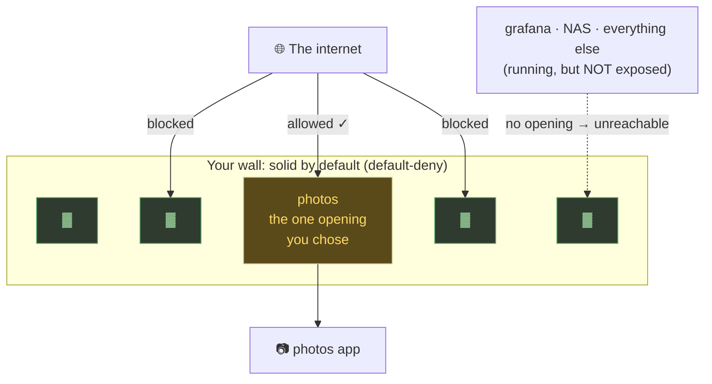
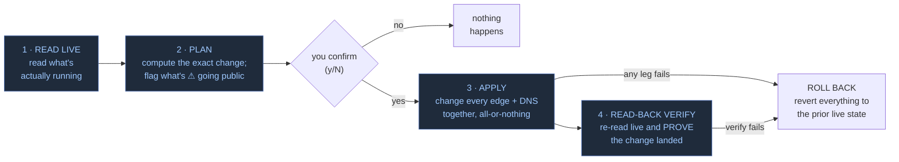
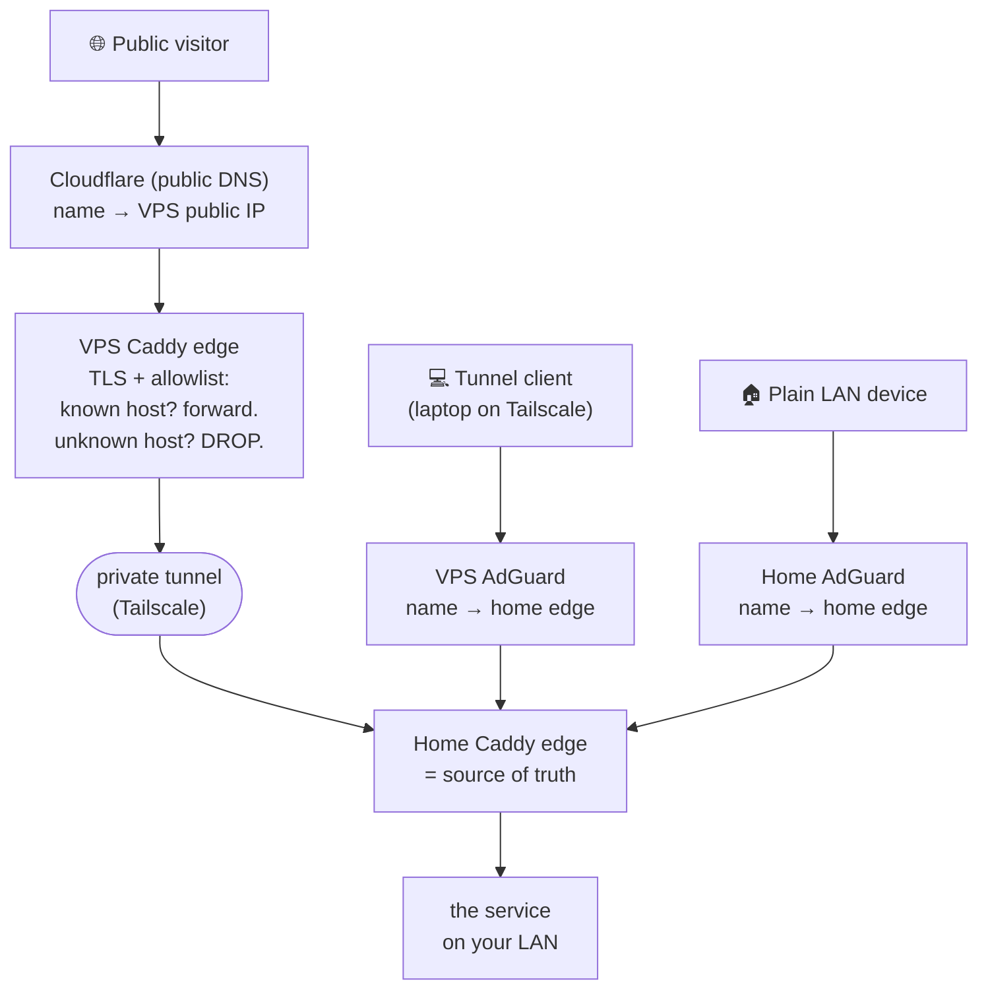

# What Crenel Does, in plain language

**Every edge in atomic agreement. Verified.**
*One file or command declares what's public → edge allowlist + split-horizon
internal/public DNS, default-deny, with plan/apply preview.*

> Written **for the operator**, not for engineers. If you run a homelab and can read a
> config file but don't write code for a living, this is the doc for you. It explains
> *exactly* what Crenel does and why it's solid, backed by what's actually been proven on
> real infrastructure. It ends with the short, finite list of trials that close the
> last gap.
>
> Everything here is checked against the real code and the recorded trial results. The tone
> is confident because the core has earned it; the honesty is exact because that's the
> whole point of the tool.

---

## Explain it back in 3 sentences

1. **Crenel is a command-line tool that controls exactly which of your self-hosted
   services are reachable from the internet**, by driving the reverse proxy, DNS, and
   tunnel you *already* run instead of you hand-editing their config files and hoping.
2. **Everything is closed by default**; a service opens *only* when you explicitly open it,
   and before Crenel changes anything it shows you the exact change, applies it across every
   edge and DNS provider as one all-or-nothing step, then re-reads the live system to prove
   it really landed.
3. **Crenel reads reality, never a stored file**, so it can't drift out of sync with what's
   actually running, and when it can't fully understand a piece of your config it says so
   loudly rather than guessing. The result is a system that is **never silently wrong.**

---

## 1. The problem it solves (in your terms)

Take a concrete setup, the one Crenel was built and proven on (hostnames anonymized
as `homelab.example` throughout): a **Caddy** reverse proxy at home that's the source of truth for
routing, a second **Caddy edge on a VPS** in front of it, **AdGuard Home** doing internal
DNS (two of them, home and VPS), **Cloudflare** for public DNS, and **Tailscale** stitching
it together. Exposing one new service safely means getting *several independent things* right,
by hand, all in agreement:

- the **home edge** routes the hostname to the right backend;
- the **VPS edge** is told it may forward that hostname (and nothing else);
- the **internal DNS** points the right clients at the right box;
- the **public DNS** points the outside world at the VPS;
- and **nothing** becomes reachable that you didn't intend.

None of those is individually hard. The danger is that they fail **silently**. A fat-fingered
Caddyfile, a wildcard left wide open, a forgotten auth gate on a public host, two AdGuard
boxes quietly disagreeing. *Nothing errors.* The config says one thing, the live system
does another, and the gap between them is where you get hurt.

**Crenel closes that gap by construction.** It treats "what is actually reachable right now"
as the only truth, makes you confirm every change before it happens, and refuses to pretend it
understands config it doesn't.

---

## 2. What Crenel is

> **Crenel keeps your wall closed by default and lets you cut deliberate, verified openings
> in it, one service at a time, across your edge, your DNS, and your tunnel, all at once.**

The name is the metaphor. A **crenel** is the notch cut into the top of a castle battlement:
the gap an archer chooses to shoot through. The wall is *solid by default*; the crenels are
the *deliberate openings*. That's exactly the posture Crenel enforces: your services are walled
off from the internet unless you cut a specific, named opening for one of them.



What Crenel *is* and *isn't*:

- **It's a control panel, not new infrastructure.** Crenel doesn't replace Caddy or AdGuard
  or Cloudflare. It *drives* them and reimplements nothing. Remove Crenel tomorrow and your
  edge and DNS keep running exactly as they are.
- **It's a single small program** (`crenel`) you run from a terminal. No background daemon, no
  database, no agent on every box. You run a command, it does the thing, it exits. (There's an
  optional read-only status dashboard, but nothing is *required* to run continuously.)
- **It keeps no "saved config of what should be exposed."** The only truth Crenel uses is what
  your live edge reports when you run a command (see §5). This is the unusual part, and the
  reason it can't drift.

---

## 3. What it actually does: the verbs, in plain language

The flagship move, in one line:

```bash
crenel expose photos --to immich:2283 --auth authelia
```

Route it on every edge, add its internal and public DNS, gate it behind your
auth. Previewed first, applied atomically, verified by re-reading the live
system. And before it writes anything at all, Crenel TCP-probes `immich:2283`:
it **refuses to expose a dead backend** (pass `--no-validate` when the address
is right but the service just isn't up yet).

Crenel is a set of commands ("verbs"). The ones that *look* never touch anything; the ones that
*change* things all follow the same safe ritual (§4).

### The "just look" commands (read-only)

| Command | What it does, plainly |
|---|---|
| `crenel status` | **"What's exposed right now?"** Reads your live edge(s) and DNS and shows every reachable host, whether the default-deny wall is intact, whether anything has drifted, and whether anything is reachable that it *couldn't fully understand*. On a terminal it draws a colored dashboard; piped into a script it prints plain text. |
| `crenel audit` | **"Is anything dangerous or inconsistent?"** Runs safety checks: a public host with no auth gate, the two DNS resolvers disagreeing, a DNS name with no matching edge route (or vice-versa), writes that won't survive a restart. Exits non-zero on a critical finding, so it drops into cron. |
| `crenel drift` | **"Has reality wandered from what's intended?"** Reports any divergence between the live state and the exposed set. Read-only; exits non-zero if there's drift, so `crenel drift \|\| alert-me` just works. |
| `crenel preview` | **"Show me the change you *would* make, but don't do it."** The first half of an `expose`/`unexpose`/`rename`: prints the exact diff, loudly flagging anything **about to go public**, then stops. |
| `crenel export` | Writes a snapshot of the live state to a file (`--redacted` strips secrets so it's safe to share). |

### The "make a change" commands (preview → confirm → apply → verify)

| Command | What it does, plainly |
|---|---|
| `crenel expose <service> [--to host:port]` | **Cut one opening in the wall.** Routes the service on your edge and adds the DNS it needs, and **refuses to publish a public host with no auth gate** unless you explicitly say `--auth none`. Shows the change first, waits for your `y`. Pass `--to <host:port>` (alias `--upstream`) to name the backend inline instead of pre-editing the origins map; Crenel TCP-probes the address first (**refuses to write a route to a dead backend**, the same discipline as default-deny applied pre-flight; the error names the three common shapes to try) and persists the entry into settings on a verified apply, so `status`/`audit`/`drift`/`reconcile` stay coherent afterwards. `--no-validate` skips the probe when the backend is not up yet but the address is known-correct. |
| `crenel unexpose <service>` | **Close that opening.** Removes the route and DNS in the reverse order (stop announcing the name *before* tearing down the route). |
| `crenel set <service> on\|off` | A friendlier alias for `expose` / `unexpose`. |
| `crenel rename <old> <new>` | **Move a service to a new hostname as one atomic step**: add the new, remove the old, copying the exact backend, mode, upstream-TLS, and auth. Proven on a real Caddy edge to survive a restart. |
| `crenel reconcile` | **"Fix all the drift."** Where `drift` only *reports*, `reconcile` corrects, converging every edge and DNS provider back onto the exposed set. Same preview-then-confirm ritual. |
| `crenel import` | **Adopt a setup you built by hand.** Scans your existing edge, shows what it *could* bring under management, and (on confirm) stamps ownership markers **in place with no behavior change**. This is how you point Crenel at your real, running setup. |
| `crenel apply <file>` | **Declarative mode** (kubectl-style): list the exposures you want in a file and Crenel converges live to match. Diff first, all-or-nothing apply, read-back verify. Optional `--adopt` and `--prune`. |
| `crenel resume` | If an apply was interrupted partway, figures out which providers already match and finishes the rest (or rolls back cleanly). |
| `crenel init` | Scaffolds starter `crenel.settings.yaml` + `crenel.exposures.yaml`. |
| `crenel serve` / `dashboard` | Serves a small read-only status dashboard. |

The mental model: **`status`/`audit`/`drift` to look, `preview` to rehearse, then
`expose`/`unexpose`/`apply`/`reconcile`/`rename` to act**. Every acting command shows you
the change before it happens.

---

## 4. The safe ritual every change follows

No mutating command ever just "does it." Each runs the same four-step ritual:



1. **Read live.** Crenel asks your actual edge "what do you currently have routed?", never a
   saved file claiming what *should* be there.
2. **Plan and preview.** It computes the precise diff and prints it, with a loud
   **"⚠ ABOUT TO GO PUBLIC"** banner naming any hostname about to become internet-reachable.
   Then it waits for your `y`.
3. **Apply, all-or-nothing.** Across your multiple edges and DNS providers it changes them
   **together as one transaction.** If any single leg fails (say the home Caddy rejects the
   config), it **rolls back every other leg** so you're never left half-applied.
4. **Read-back verify.** After applying, it re-reads each provider's live state to confirm the
   change is really there. **An admin API saying "200 OK" is explicitly NOT trusted as proof.**
   Only re-reading the live state counts. If verification fails, it rolls back.

There's also a **make-before-break** ordering: on expose, routes come up *before* the public
name is announced; on unexpose, the name stops resolving *before* the route is torn down. So
there's never a window where the world can resolve a name that doesn't route yet.

---

## 5. Why it's solid: the design, and the proof on real infra

Four deliberate design choices are what make Crenel safe to point at production:

- **Live-state-authoritative (nothing to drift from).** It keeps **no stored desired state.**
  The only intent is the command you're running now; the only truth is what the edge reports
  live. It can't disagree with its own config file because it doesn't have one.
- **Preview before apply.** You always see the exact change, especially anything going public,
  before it happens. `--yes` skips the "are you sure?" prompt but **never** skips the
  public-with-no-auth refusal: opening a public host with no auth is always a deliberate
  `--auth none`.
- **Read-back verify.** "It said OK" is never enough. Every change is proven by re-reading live.
- **Default-deny is structural, not a setting.** A host is reachable *only if* an explicit route
  exists **and** the catch-all "deny everything else" rule is present. Every driver always writes
  and always reports that catch-all. You can't accidentally turn the wall off.
- **Bounded honesty: it never pretends to understand.** Config it can't fully parse becomes a
  *declared unknown*: counted, shown, and mutation-blocking. The wall is reported **ENFORCED only
  when the config was fully understood**, otherwise **UNKNOWN**, never a falsely reassuring green.
  And Crenel **refuses to manage** any route it determines is owned by another tool, or whose
  ownership it can't establish. The worst case is "Crenel tells you it doesn't know."

### How is this different from Terraform (or Ansible)?

Fair question, and the first one most infra people ask.

Terraform keeps a state file — its record of what it thinks the world looks
like — and reconciles reality toward that file. That works until the file and
reality disagree: someone hand-edits the edge, a record changes out of band, the
state drifts, and now Terraform's model of your infrastructure is a confident lie
it will happily act on. Managing, locking, and un-drifting that state file becomes
its own chore.

Crenel has no state file, no database, no stored desired state. Every command
reads the live edge directly — the running Caddy admin API, the actual DNS
records, the config that's actually loaded — and works from that. There's nothing
to drift, because there's nothing stored to drift from. `status` tells you what's
exposed right now, from reality. `audit` and `drift` exit non-zero the moment the
live edge disagrees with what you declared, so you find out on your terms instead
of at 2am.

The trade-off, honestly: crenel isn't a full IaC system that provisions your whole
world from a declaration. It's narrower — it governs edge exposure (proxy route +
DNS + auth) and treats the live edge as the only source of truth. Where it
overlaps Terraform, it's betting that for this problem, reading reality beats
trusting a cached model of it.

(Same logic applies to hand-editing — where the "state file" is your memory — and
to Ansible, where the playbook is a hopeful description of a run that may or may
not still hold.)

### This isn't just design; it's been proven on real production gear

The claims above have been exercised against **real production infrastructure**, each run recorded
byte-for-byte in a `TRIAL-RESULT-*.md` and reverted so production was left exactly as found:

- **It reads your production edge safely.** A read-only trial on the live VPS edge saw the real
  config, declared what it couldn't fully parse, and mutated nothing.
- **It moves a service on a real home edge, and it survives a reboot.** A live `expose`
  landed *inside* the production `*.homelab.example` wildcard site (no shadow block, operator bytes
  byte-identical) and **still served after a full `docker restart caddy`**: it came from the
  on-disk Caddyfile, not ephemeral admin memory. The full **expose → restart → unexpose →
  restart** cycle then ran green and byte-for-byte *by Crenel*, after the trial caught a real
  teardown bug, which was fixed before re-running. This is the home-edge durability gate, closed.
- **It coordinates a write across BOTH edges, atomically.** The first live cross-edge write hit a
  genuine config-rejection bug and **aborted with zero changes to either edge**: the all-or-nothing
  net doing its job (and catching a bug the test suite structurally couldn't). The bug was fixed,
  the coordinated auth+TLS chain write was validated live across both edges, and a follow-up drove
  the gate to the literal `302 → auth.…` redirect.
- **It manages public DNS on real Cloudflare without touching anything else.** Surgical,
  one-record-at-a-time Cloudflare was proven end-to-end on a dedicated zone (`crenel.sh`: expose →
  `dig` confirms → unexpose → gone, with TTL/proxied fidelity and rollback), **and** as a
  record-level safety proof on the real **shared production zone**: Crenel created only its
  own `managed-by:crenel`-marked record while the operator's pre-existing wildcard stayed **byte-identical**
  through expose and unexpose, then restored.
- **It drives internal AdGuard resolvers.** AdGuard rewrites proven live on a disposable host (restored
  byte-for-byte), and the dual-resolver parity check exercised across both production AdGuards,
  restored byte-for-byte and catching a real divergence between them.
- **The tests are adversarial and catch real bugs.** 498 test functions, race-clean, built on a
  strict rule: *a fake may only accept what the real edge accepts, and must reject what it
  rejects.* A multi-agent adversarial review even caught a real prefix-collision bug in the
  Cloudflare ownership check and fixed it RED→GREEN before the live trial.

### How a real request flows through this setup



Crenel's job is to keep **all five control points** (Cloudflare, VPS edge, both AdGuards, home
edge) in agreement on a single `expose`. The public path always transits the VPS edge, which
forwards only **allowlisted** hostnames and drops the rest. That's the wall. The two AdGuards
answer different client populations (on the tunnel vs. not) with the *vantage-correct* target,
the "split-horizon" piece. (Full detail: `REFERENCE-ARCH-split-horizon.md`.)

---

## 6. The finite punch-list to total confidence

This is the honest part, and it's deliberately a **short, knowable checklist**, not a hedge.
Each item below is either already done, a trial to *run*, or a known limit to *accept or extend*.
None of them is a silent risk: anything not fully handled is *declared*, never guessed. This is
the road from "the core is proven" to "I run everything through it without thinking about it."

**1. Run the whole chain as one routine production expose. ✅ DONE (2026-06-30).** The full
coordinated expose of a real service (**`finances.homelab.example`**, from the home-edge host) was driven
end-to-end by a single Crenel run: the home edge route, the VPS edge allowlist, both AdGuard
rewrites, and the public Cloudflare record, all gates green. Every leg was already individually
proven; this bundled them into one ordinary `crenel expose` on the real production stack. The remaining
work here is just *repetition*, making it a day-to-day habit, not a missing capability.

**2. Two known structural limits, each bounded and visible (accept, or extend later):**

- **Marker-less AdGuard value-ownership.** Crenel's Cloudflare records carry a `managed-by:crenel`
  marker, so it can always tell its own records from yours. **AdGuard rewrites have no such marker
  field**; they're just `name → answer`. So Crenel can't tell a stale Crenel rewrite from one you
  set by hand, and it therefore *deliberately doesn't* run value-drift detection on AdGuard (doing
  so would cry wolf on your own intentional rewrites). It still guards AdGuard by zone-confinement
  and by refusing to clobber a differing foreign value. It just can't do full value-drift there.
  Closing this would need either an upstream AdGuard change or a stored manifest (which would
  contradict the no-stored-state design that makes everything else trustworthy).
- **Path-granular routing: detected, not yet writable.** A route scoped by something other than
  the hostname (a Caddy `path`/`method`/`header` matcher, a Traefik `PathPrefix`, multiple nginx
  `location` blocks) is **noticed and declared** (so it's never misread as a plain host route),
  but Crenel can't yet *write* a per-path backend or per-path auth. Read-safe today; write support
  is a known extension.

**3. One smaller edge: Tailscale tailnet-only scope.** A Tailscale serve entry *with* funnel
(public) is handled. A tailnet-only `Web` entry is no longer mis-flagged as public, but it
doesn't yet have its own positive "tailnet-scoped" category, and writing Tailscale serve config
isn't supported yet.

That's the whole list.

### So how far should you trust it today?

- **Read-only (`status`, `audit`, `drift`, `preview`, `export`): trust it now.** It only reads,
  and where it's unsure it says UNKNOWN. The natural way to start: point it at your real setup and
  *look*.
- **Single-edge and home-edge writes (`expose`/`unexpose`/`rename`, durable): proven on a real
  production Caddy, including restart-survival.** The high-confidence write path.
- **The full multi-provider coordinated expose: proven end-to-end on the real production stack**
  (`finances.homelab.example` from the home-edge host, all gates green; item 1 above). This was the last big one.

The core is proven, full chain included, and the remaining list is down to one live-only
item (Tailscale serve *writes*) plus two bounded, visible structural limits. That's the basis for
confidence: not "it should be fine," but "here is exactly what's been demonstrated, and here is the
short list that remains."

---

## 7. Where to go deeper

- **`README.md`**: project overview and quickstarts.
- **`STATE-OF-CRENEL.md`**: the single source of truth for what's built vs gated, PR by PR.
- **`docs/REFERENCE-ARCH-split-horizon.md`**: the preferred architecture (public edge + home SOT
  + dual-AdGuard split) this is all built to drive.
- **`DESIGN.md`**: the architecture and the load-bearing invariants.
- **`SECURITY.md`**: the threat model, what secrets the config holds, and the redaction guarantee.
- The **`archive/trials/results/TRIAL-RESULT-*.md`** files: the byte-for-byte records behind
  the durable-persist, chain-write, rename, and dedicated-zone Cloudflare proofs, plus
  **`TRIAL-RECORD-live-proofs-2026-06-30.md`** (repo root) for the 2026-06-30 operator-record
  proofs (shared-zone Cloudflare, dual-AdGuard parity, and the `finances.homelab.example`
  full-chain expose). Hostnames/IPs in all of these are anonymized for publication; the
  commands, configs, and results are otherwise verbatim.
</content>
